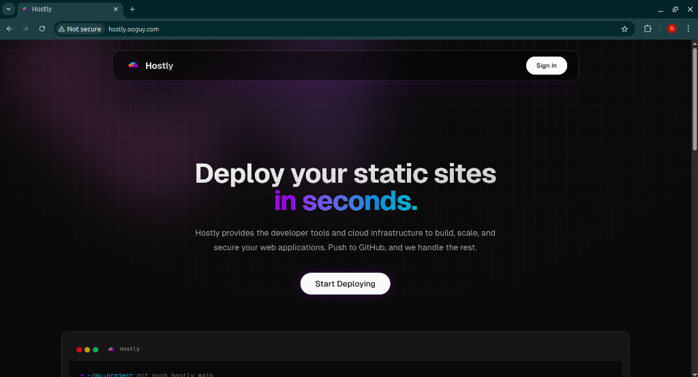
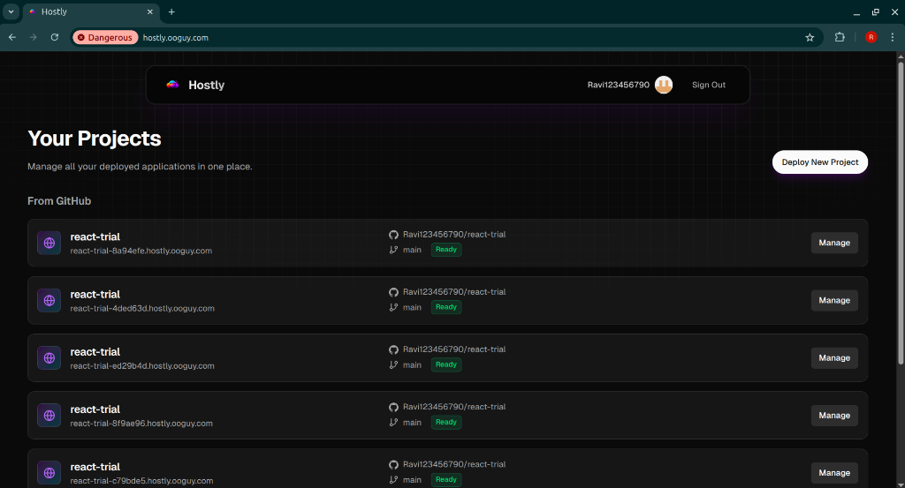
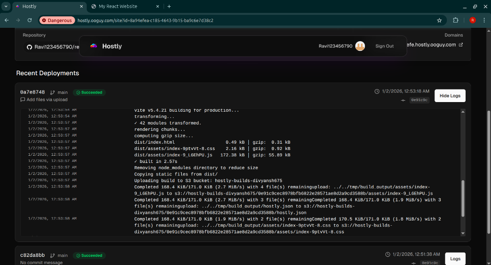
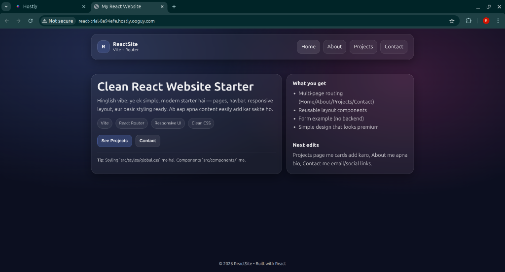

# Hostly - Cloud Hosting Platform 🚀



**Hostly** is a **full-stack cloud hosting platform** similar to Vercel or Netlify. It allows you to connect your GitHub repositories and deploy your React/Next.js applications with a single click.

🔗 **Live Demo:** [http://hostly.ooguy.com](http://hostly.ooguy.com)  
💻 **Source Code:** [https://github.com/DIVYANSH-675/Hostly](https://github.com/DIVYANSH-675/Hostly)

---

## 🌟 Features

- **One-Click Deployments**: Connect GitHub repos and deploy instantly.
- **Automatic Builds**: Dockerized build pipeline automatically builds user code.
- **Custom Subdomains**: Every project gets a unique `*.hostly.ooguy.com` subdomain.
- **Live Logs**: Real-time streaming logs of the build process.
- **Smart Routing**: Custom reverse proxy routes requests to the correct S3 bucket based on subdomain.



---

## 🏗️ Architecture

Hostly consists of 3 main microservices working together:

### 1. Web App (Dashboard) `apps/web`
The main dashboard where you manage projects.
- **Tech**: Next.js App Router, Tailwind CSS, tRPC, Drizzle ORM, Postgres.
- **Role**: Handles authentication (GitHub OAuth), project management, and triggers deployments.

### 2. Builder Service `apps/builder`
The "worker" that builds your site.
- **Tech**: Node.js, Docker, Bash scripts, AWS S3.
- **Role**: Clones your code, detects framework (Vite/Next.js), builds it, and uploads assets to S3.



### 3. Router / Reverse Proxy `apps/router`
The gateway that serves your deployed sites.
- **Tech**: Hono.js (Node.js), Redis.
- **Role**: Checks Redis to map `subdomain -> S3 Path` and serves the correct files to the user.



---

## 🚀 Deployment Guide

This folder contains everything you need to deploy Hostly to your own AWS account.

### 1. Prerequisites 📋
You need these accounts:
- **AWS Account** (for hosting ECS/Fargate)
- **GitHub Account** (for OAuth app)
- **Neon / PostgreSQL** (database)
- **Upstash / Redis** (caching)

### 2. Setup Configuration ⚙️

We have created example files for you. Just copy and fill them in!

#### Step A: Web App Config
1. Go to `apps/web`.
2. Copy `.env.example` to `.env`.
   ```bash
   cp apps/web/.env.example apps/web/.env
   ```
3. Fill in your API keys (AWS, GitHub, DB).

#### Step B: Router Config
1. Go to `apps/router`.
2. Copy `.env.example` to `.env`.
   ```bash
   cp apps/router/.env.example apps/router/.env
   ```
3. Fill in your API keys.

#### Step C: AWS Task Definitions
1. Copy the example JSON files in this folder:
   - `web-td.example.json` → `web-td.json`
   - `builder-td.example.json` → `builder-td.json`
   - `router-td.example.json` → `router-td.json`
2. Open them and replace `YOUR_ACCOUNT_ID`, `YOUR_REGION` etc. with your real info.
   - **Tip:** Ensure `BUILDER_CALLBACK_URL` in `web-td.json` points to your deployed Web App IP!

### 3. How to Deploy 🚢

**Step 1: Push Code to GitHub**
Ensure all your code is pushed to your repository.

**Step 2: Build & Push Docker Images**
Run these commands **from this `deployment` folder** (not inside `apps/`):

```bash
# 1. Hostly Web
docker build -f apps/web/Dockerfile -t hostly-web .
aws ecr get-login-password --region us-east-1 | docker login --username AWS --password-stdin YOUR_ACCOUNT_ID.dkr.ecr.us-east-1.amazonaws.com
docker tag hostly-web:latest YOUR_ACCOUNT_ID.dkr.ecr.us-east-1.amazonaws.com/hostly-web:latest
docker push YOUR_ACCOUNT_ID.dkr.ecr.us-east-1.amazonaws.com/hostly-web:latest

# 2. Hostly Router
docker build -f apps/router/Dockerfile -t hostly-router .
docker tag hostly-router:latest YOUR_ACCOUNT_ID.dkr.ecr.us-east-1.amazonaws.com/hostly-router:latest
docker push YOUR_ACCOUNT_ID.dkr.ecr.us-east-1.amazonaws.com/hostly-router:latest

# 3. Hostly Builder (Standalone)
cd apps/builder
docker build -t hostly-builder .
docker tag hostly-builder:latest YOUR_ACCOUNT_ID.dkr.ecr.us-east-1.amazonaws.com/hostly-builder:latest
docker push YOUR_ACCOUNT_ID.dkr.ecr.us-east-1.amazonaws.com/hostly-builder:latest
cd ../..
```

**Step 3: Register & Launch**
```bash
# Register Tasks
aws ecs register-task-definition --cli-input-json file://deployment/web-td.json
aws ecs register-task-definition --cli-input-json file://deployment/builder-td.json
aws ecs register-task-definition --cli-input-json file://deployment/router-td.json

# Update Services
aws ecs update-service --cluster hostly-builder2 --service hostly-web --task-definition hostly-web
aws ecs update-service --cluster hostly-builder2 --service hostly-router --task-definition hostly-router
```

## 🔧 Troubleshooting
- **Logs not showing?** Check `BUILDER_CALLBACK_URL` in `web-td.json`.
- **Site not loading?** Check Security Groups (Port 80/443).
- **Database error?** Verify `DATABASE_URL` in `.env`.

---
*Built with ❤️ by [Divyansh](https://github.com/DIVYANSH-675)*
📧 **Contact:** divyanshgupta0704@gmail.com
